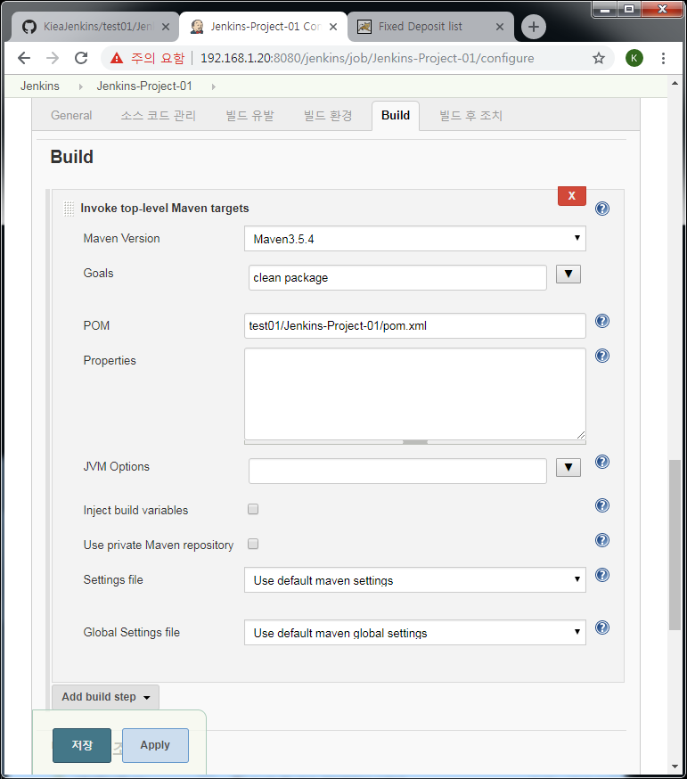

Jenkins-Project-01
==================

Jenkins-Project-01 with maven3.5.4

Setting on Jenkins job
----------------------

- General  

- 소스 코드 관리  

- 빌드 유발  

- 빌드 환경  

- Build  

- 빌드 후 조치  

.....

